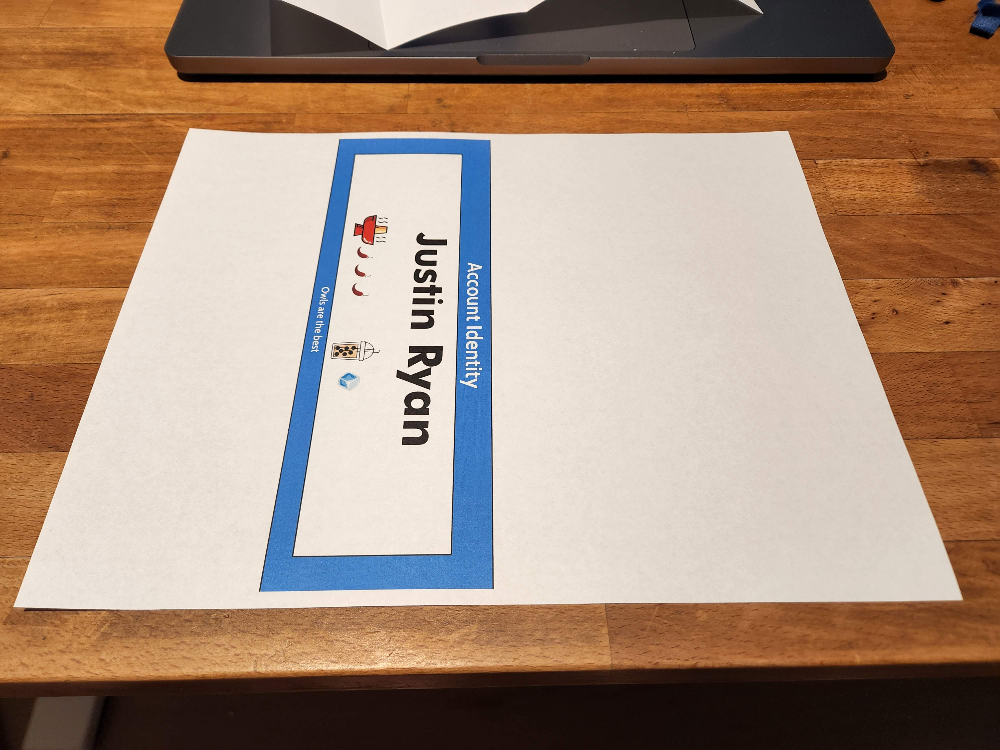

# Nametag Printer

This is a pet project to print a name tag that will fit into a cheap acrylic name plate holder. 
These can be found on Amazon, and are economically bought in a bundle of to buy a bunch 24.
They can accept a folder 8.5"x11" sheet of paper, the trick is printing in the exact region that will be seen once folded.
This project aims to simplify layout to match the holder, with some adjustability so that it can be customized for different people. 

[](https://www.amazon.com/gp/product/B09KXXPRRM?ie=UTF8&psc=1&linkCode=li2&tag=halfemptyorg-20&linkId=da70184524b672c4dd7aa3dda967b103&language=en_US&ref_=as_li_ss_il)

## Running

The project is written in .Net and most easily by running the `dotnet` command.

### Examples
```shell
dotnet run --name "My Name" --team "Best Team Ever" --image "avatar.png" --quote "Hello World"
```

The above will output to result.pdf

Here's an example with all the features in place:

```shell
dotnet run --verbose --output JustinNametag.pdf --name "Justin Ryan" --team "Accounts > AuthSec > Auth Usability" --image "justin.png" --quote "Owls are the best" --username "OwlMaster99"
```

### Arguments

| Argument         | Required | Description                                                       |
|------------------|----------|-------------------------------------------------------------------|
| -n, --name       | Yes      | The person's full name (supports text wrapping for long names)    |
| -t, --team       | Yes      | Team name shown in the header                                     |
| -i, --image      | Yes      | Path to personalized PNG image (displayed left of name)           |
| -q, --quote      | Yes      | Funny quote displayed at the bottom                               |
| -u, --username   | No       | Roblox display name, shown centered under the image               |
| -v, --verbose    | No       | Set output to verbose messages                                    |
| -b, --borderless | No       | Print an ideal borderless layout, only works with inkjet printers |
| -o, --output     | No       | File to save output to, defaults to result.pdf                    |
| --help           | No       | Display this help screen                                          |
| --version        | No       | Display version information                                       |

## Printing

Print the output without any scaling.

## Folding

In an ideal mode is to print at the bottom of the page with no margins, but that's not possible on laser printers.
To compensate for this, the default mode is to shift the name tag up, so the background can fill the top and bottom.
The sides will still get cut off though, you can optionally cut them off. Start with the print out:



### Step 1
Flip the paper over.

### Step 2

Fold in half and open back up.


### Step 3

Folder ends into the middle.


### Step 4

Flip over and slide into holder.


### Borderless

To folder from a borderless mode, fold the paper in half, twice.
## Layout

The nametag layout consists of:

```
+--------------------------------------------------+
|              Team Name (header)                  |  <- Blue background
+--------------------------------------------------+
|                                                  |
|    +-------+                                     |
|    | IMAGE |    Full Name Here                   |  <- White content area
|    +-------+    (wraps if long)                  |
|                                                  |
+--------------------------------------------------+
|              "Funny quote here"                  |  <- Blue background
+--------------------------------------------------+
```

- **Team**: Displayed in the blue header at the top
- **Image**: Personalized PNG image on the left side of the content area (80x80 points)
- **Username**: Optional Roblox display name, centered under the image
- **Name**: Displayed to the right of the image, automatically wraps to multiple lines if too long
- **Quote**: Displayed in the blue footer at the bottom